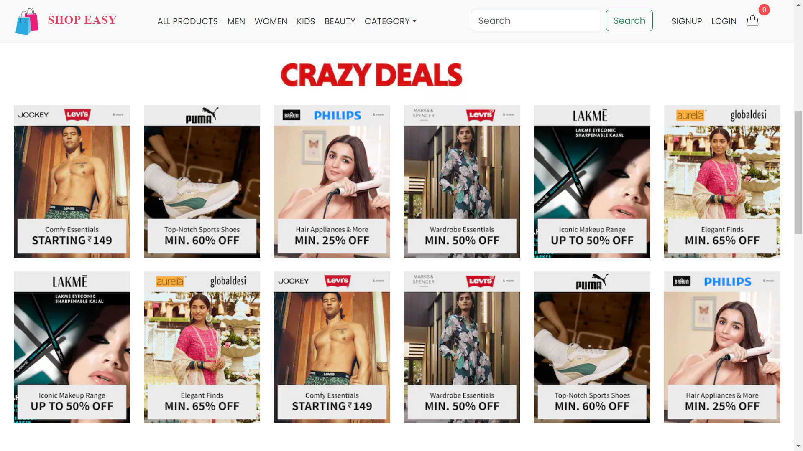
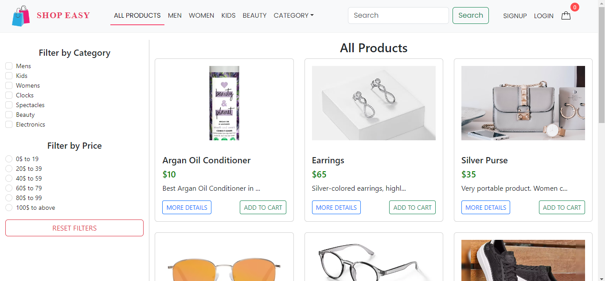
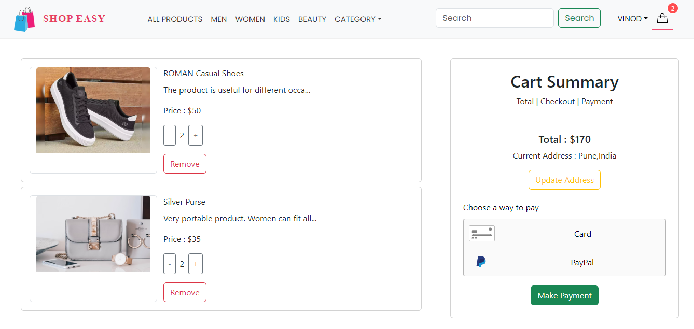
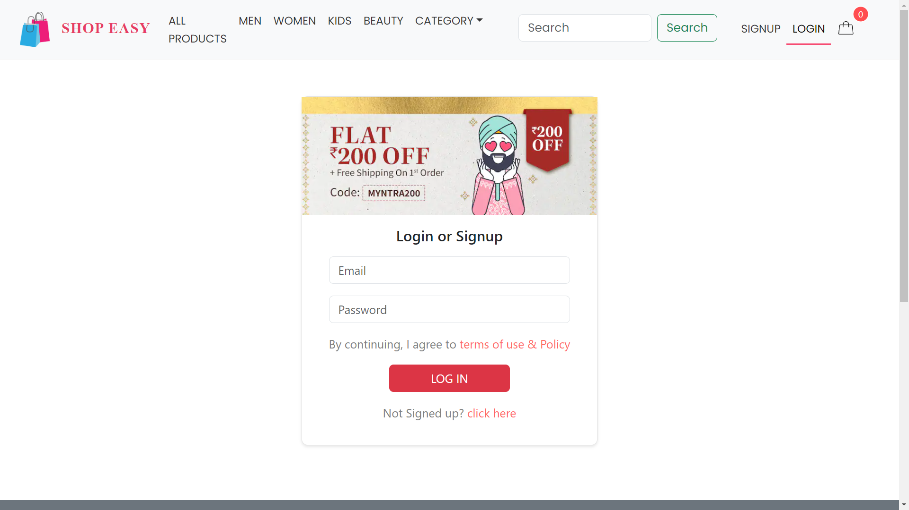
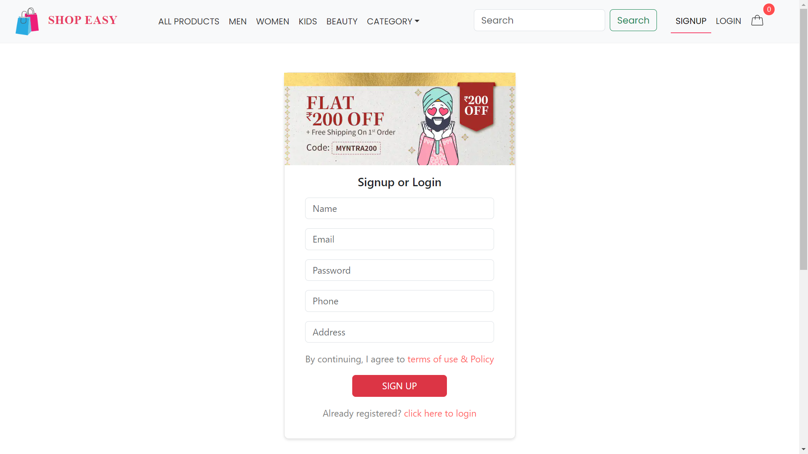

# ShopEasy

Welcome to the ShopEasy - A Clone of Myntra website!! This is a full-stack e-commerce application developed using the MERN stack. The project aims to replicate the core features and user experience of the popular online fashion and lifestyle marketplace, Myntra.


## Features

- User Authentication
- Product Catalog
- Product Search and Filters
- Product Details
- User Cart
- Order Placement,Payment Integration
- User Profile
- Admin Side

## Technologies Used

**Frontend :** React.js, Bootstrap and ant-design for styling.

**Backend :** Node.js with Express.js for the server, MongoDB as the database.

**Authentication :** JSON Web Tokens (JWT) for secure authentication.


## Deployment
- Frontend deployed on vercel
[ShopEasy](https://shopeasy-xi.vercel.app/)

- Backend deployed on render

## Installation

Step-by-step instructions on how to install and run this project locally

```bash
1. Clone the repository
   git clone https://github.com/your-username/your-repository.git

2. Change into the project directory
   cd your-repository

3. Install dependencies
   npm install

4. Start the development server
   npm start

```
    
## Screenshots
### Homepage




### All Product
  


### Categorywise Product page
  


### Product details page
  


### Cart page
  


### Login page
  


### Register page
  


### User dashboard
  


### Admin Panel
  


